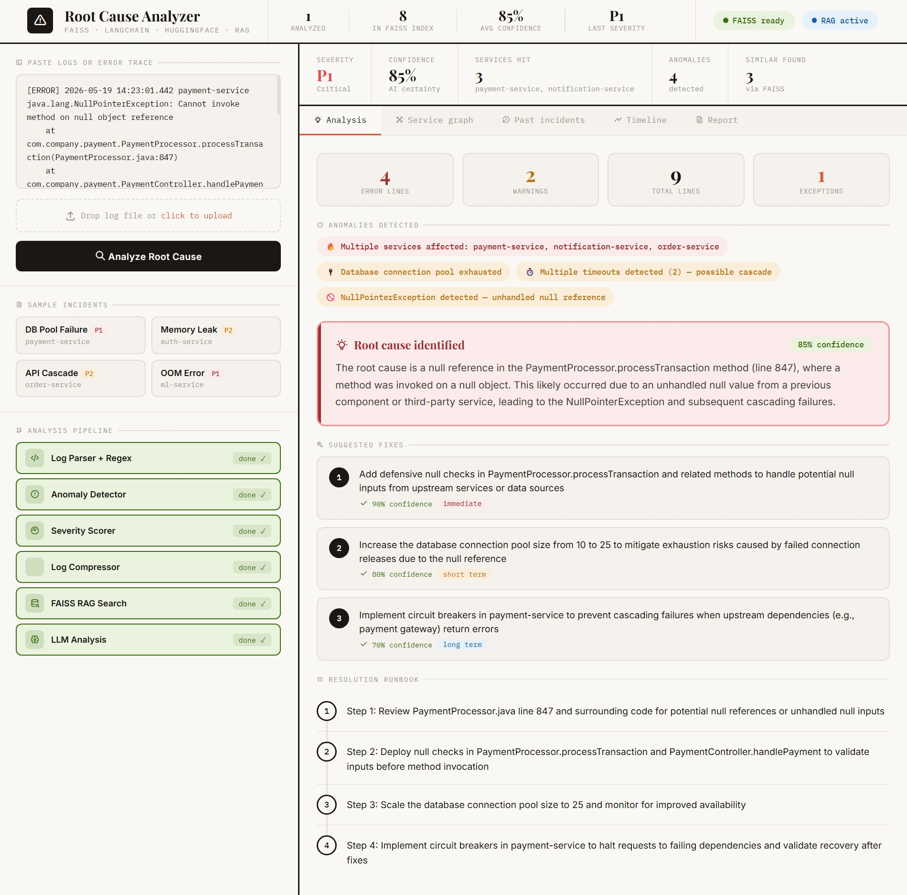

```
code README.md
```

Paste this:

```markdown
# AI Root Cause Analyzer 🔍

Feed it server logs, error traces, and metrics — AI analyses patterns, identifies the probable root cause of a system failure, and suggests fixes by retrieving past incident reports using RAG.

## Demo


## How It Works
1. Paste server logs or upload a log file
2. Log parser extracts structured data — error lines, warnings, exceptions, services, timestamps
3. Anomaly detector programmatically identifies spikes, cascades, OOM, connection pool exhaustion, and timeout patterns
4. Severity scorer auto-rates the incident P1–P5 based on detected patterns
5. Log compressor prioritises critical lines to fit LLM context window
6. FAISS RAG searches 8+ past incidents locally using vector similarity — no cloud needed
7. LLM analyses root cause with RAG context, generates fixes with confidence scores and a step-by-step runbook
8. Service dependency graph visualises cascade failures using D3.js
9. Full incident report generated in Slack/PagerDuty format ready to copy

## Core Concepts

**FAISS Local Vector Search** — Facebook AI Similarity Search runs entirely on your machine. Past incidents are embedded and stored as vectors. When new logs arrive, FAISS finds the top 3 most similar past incidents in milliseconds using cosine similarity. No cloud, no API calls, no cost.

**RAG over Incident History** — Retrieved past incidents become context for the LLM. Instead of guessing, the AI reasons: "This looks like INC-2847 which was a connection pool issue resolved by increasing pool size." Grounded responses, not hallucinations.

**Anomaly Pattern Detection** — Before sending to AI, regex and statistical rules detect: error spikes, cascade failures across services, OutOfMemoryError patterns, connection pool exhaustion, timeout cascades, and NullPointerExceptions. This is faster and more reliable than asking an LLM to detect patterns.

**Severity Scoring (P1–P5)** — Programmatic scoring based on anomaly severity, error count, number of services affected, and exception types. P1 = critical cascade, P5 = informational. Mirrors real-world SRE practice at Google, Netflix, and Stripe.

**Log Compression** — Logs can be 50,000+ characters. The compressor prioritises error lines, warnings, and stack traces to fit within the LLM context window. Same concept as RAG chunking but applied to real-time log streams.

**Service Dependency Graph** — D3.js force-directed graph shows which service caused the cascade. Root cause nodes highlighted in red. Interactive — drag nodes to explore dependencies.

**LangChain + FAISS** — LangChain manages the RAG pipeline. FAISS handles vector storage and similarity search locally. sentence-transformers generates 384-dimensional embeddings using all-MiniLM-L6-v2.

## Tech Stack
* FastAPI — async Python web framework
* FAISS — local vector similarity search (Facebook AI)
* sentence-transformers — local embedding model (all-MiniLM-L6-v2)
* LangChain — RAG pipeline orchestration
* OpenRouter — free LLM API for root cause analysis
* D3.js — interactive service dependency graph
* Playfair Display + IBM Plex Mono — editorial warm UI design
* HTML/CSS/JS — beige editorial theme frontend

## New Tools Explored
* **FAISS** — World's fastest vector search library by Facebook AI Research. Runs 100% locally. Used by Meta, Google, and Microsoft internally for billion-scale similarity search. Free forever.
* **FastAPI** — Modern async Python web framework. Faster than Flask, automatic API docs at `/docs`, built-in Pydantic validation.
* **D3.js** — Industry standard data visualisation library. Used to build the interactive force-directed service dependency graph.

## Setup
1. Clone this repo
2. Install dependencies:
```
pip install fastapi uvicorn sentence-transformers faiss-cpu python-dotenv requests langchain langchain-community
```
3. Create a `.env` file:
```
OPENROUTER_API_KEY=your-openrouter-key
```
4. Run:
```
python app.py
```
5. Open browser at `http://127.0.0.1:8000`

## Project Structure
```
ai-root-cause-analyzer/
├── app.py              # FastAPI backend and routes
├── analyzer.py         # Full analysis pipeline orchestrator
├── log_parser.py       # Regex log parser + anomaly detector + severity scorer
├── rag_engine.py       # FAISS vector store + similarity search
├── faiss_index/        # Local FAISS index files (auto-created)
├── templates/
│   └── index.html      # Warm editorial UI with D3.js graph
├── static/             # Static assets
├── .env                # API keys (never commit this)
├── .gitignore
└── README.md
```

## Analysis Pipeline
```
Raw logs
   ↓
Log Parser → structured data (errors, services, exceptions, timestamps)
   ↓
Anomaly Detector → spikes, cascades, OOM, pool exhaustion, timeouts
   ↓
Severity Scorer → P1 Critical / P2 High / P3 Medium / P4 Low / P5 Info
   ↓
Log Compressor → prioritise critical lines for LLM context window
   ↓
FAISS RAG → top 3 similar past incidents by vector cosine similarity
   ↓
LLM Analysis → root cause + fixes with confidence + runbook
   ↓
Service Graph → D3.js cascade visualisation
   ↓
Incident Report → Slack/PagerDuty ready output
```

## Sample Incidents Included
* DB connection pool exhaustion (P1) — payment-service
* Memory leak causing OOM (P2) — auth-service
* API timeout cascade (P2) — order-service
* OutOfMemoryError in ML inference (P1) — ml-service
* Redis cache connection leak (P1) — cache-service
* CPU spike in ML service (P3) — ml-service
* Disk space exhaustion (P2) — logging-service
* API gateway rate limit misconfiguration (P1) — api-gateway

## What I Learned
* FAISS — local vector similarity search without any cloud dependency
* RAG applied to DevOps — retrieving past incidents as context for LLM reasoning
* Anomaly pattern detection — programmatic log analysis before AI
* Severity scoring systems — how SRE teams classify incident priority
* Log compression — fitting real-world logs into LLM context windows
* Service dependency graphs — visualising cascade failures with D3.js
* FastAPI — async Python APIs with automatic validation and Swagger docs
* LangChain RAG pipeline — orchestrating embeddings, vector search, and generation
```

